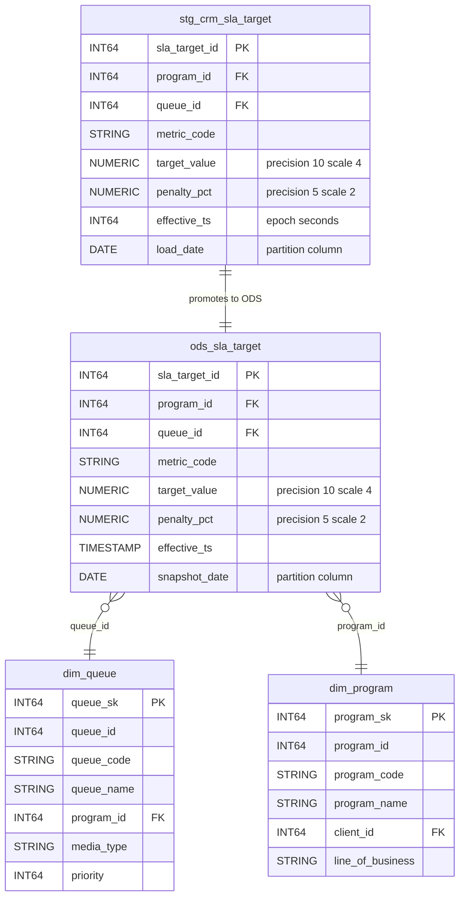

# Locked Decisions for Story e8280af6-c629-4f55-9f39-fd72910d5390

## Implementation Approach
## Implementation Approach — BigQuery Physical Schema DDL

### DDL Generation & File Organization

A Python generator script (`tools/generate_bq_ddl.py`) reads `manifests/tables.yaml` and emits 101 BigQuery `CREATE TABLE` SQL files, organized by dataset:

```
sql/ddl/
├── nbcs_staging/    (45 files: one per staging table)
├── nbcs_ods/        (31 files: 30 existing + ods_sla_target)
└── nbcs_dm/         (25 files: 9 dims + 9 facts + 7 aggs)
```

**One file per table** because:
- AC1 requires naming the specific failing table on DDL error — individual files enable granular error attribution
- MVS `migration:` blocks reference each file as a discrete `kind: ddl` step
- Enables parallel validation and independent code review

The generator encodes all locked type-mapping, partitioning, clustering, and description rules. Its output (the committed SQL files) is the deliverable; the generator is a development tool for reproducibility.

### Core Type Mapping (hardcoded in generator)

| Hive Type | BigQuery Type | Affected Count |
|---|---|---|
| `BIGINT` | `INT64` | ~400 columns |
| `INT` | `INT64` | ~60 columns |
| `STRING` | `STRING` | ~300 columns |
| `BOOLEAN` | `BOOL` | ~40 columns |
| `TIMESTAMP` | `TIMESTAMP` | ~70 columns |
| `DOUBLE` | `FLOAT64` | 2 columns (speech_analytics) |
| `DATE` | `DATE` | 0 source columns (only generated partition columns) |
| `DECIMAL(p,s)` | `NUMERIC(p,s)` | 52 columns across 7 variants |
| `ARRAY<STRUCT<...>>` | `ARRAY<STRUCT<...>>` | 2 columns |
| `ARRAY<STRING>` | `ARRAY<STRING>` (REPEATED) | 1 column |
| `MAP<STRING,STRING>` | `ARRAY<STRUCT<key STRING, value STRING>>` | 1 column |

### Partition Strategy Implementation

BigQuery requires `DATE`, `TIMESTAMP`, `DATETIME`, or `INT64` for partitioning — Hive STRING partition columns are type-promoted:

| Source Partition Pattern | BigQuery Implementation | Tables |
|---|---|---|
| `date_key INT` (DM facts/aggs) | Ingestion-time partitioning via `_PARTITIONTIME` | 11 facts + 5 aggs partitioned by date_key |
| `week_start_key INT` | Ingestion-time partitioning via `_PARTITIONTIME` | agg_agent_weekly |
| `period_month STRING` | Kept as `STRING`; partition via ingestion-time `_PARTITIONTIME` | fact_billing_line, agg_program_monthly, agg_csat_rollup_monthly, agg_billing_monthly, ods_payroll_adjustment, ods_sla_credit |
| `eff_from_year INT` | Integer-range partition: `RANGE_BUCKET(eff_from_year, GENERATE_ARRAY(2020, 2030, 1))` | 3 SCD-2 tables |
| `load_date STRING` | Type-promoted to `DATE`; `PARTITION BY load_date` | 27 staging sqoop mirrors |
| `extract_ts STRING` | Type-promoted to `TIMESTAMP`; `PARTITION BY extract_ts` | 8 staging delta feeds |
| `feed_date STRING` (+`client_code`) | `feed_date` promoted to `DATE` (partition); `client_code` as `CLUSTER BY` | 10 staging file feeds |
| `event_date/snapshot_date/call_date/sched_date STRING` | Type-promoted to `DATE`; direct partition column | 15+5 ODS cleansed + delta-merge tables |
| `work_month/swap_month/event_month STRING` | Kept as `STRING`; partition via ingestion-time `_PARTITIONTIME` | 3 ODS delta-merge tables |
| Unpartitioned (ACID + dims) | No partitioning | 4 ACID + 9 DM dims |

**Key rule:** Hive `CLUSTERED BY ... INTO N BUCKETS` (ACID bucketing for 4 ODS tables, hash bucketing for `stg_tel_call` and `fact_interaction`) is **NOT** carried to BigQuery — ACID bucketing is Hive-specific and Hive hash-bucketing has no BQ equivalent. Performance intent is met by BQ clustering.

### Clustering Columns

Applied per the locked Performance Optimization matrix. Examples:
- `fact_interaction`: `CLUSTER BY (channel, agent_sk, program_sk)`
- `agg_agent_daily`: `CLUSTER BY (agent_sk, site_code)`
- DM dimensions: `CLUSTER BY (<pk_column>)` (e.g., `dim_date` clustered by `date_key`)
- Staging file feeds: `CLUSTER BY (client_code)`
- All other staging/ODS tables: no explicit clustering

### Column Descriptions

All 68 source column COMMENTs carried as BigQuery `OPTIONS(description=...)`:
- Epoch annotations preserved: `'epoch SECONDS (legacy)'`, `'epoch MILLISECONDS (legacy)'`
- **Lying columns** get explicit warnings:
  - `stg_fin_invoice.issued_ts_sec`: `'WARNING: column name says seconds but VALUES ARE EPOCH MILLISECONDS — see EPOCH-POLICY.md'`
  - `stg_fin_invoice.due_ts_sec`: `'WARNING: column name says seconds but VALUES ARE EPOCH MILLISECONDS — see EPOCH-POLICY.md'`
- Oracle string dates: `'Oracle string YYYYMMDDHH24MISS (legacy)'`

### Staging Epoch Policy

Per `docs/EPOCH-POLICY.md` and locked Schema & Data Model decision: all epoch BIGINT columns in `nbcs_staging` remain `INT64` — **no conversion to TIMESTAMP**. The conversion boundary is ODS. This is enforced in the generator and validated by the MVS spec.

### Multi-Column Hive Partitions

Two tables have multi-column Hive partitions that BigQuery cannot replicate:
- `stg_wfm_schedule`: `PARTITIONED BY (load_date STRING, site_code STRING)` → BigQuery: `load_date DATE` as partition, `site_code` becomes a regular column (no clustering specified per locked decision)
- `fact_interaction`: `PARTITIONED BY (date_key INT, channel STRING)` → BigQuery: ingestion-time partition (`_PARTITIONTIME`), `channel` moves to `CLUSTER BY`

### MVS Harness Integration

DDL files integrate with the project's Mode-2 build-and-verify pattern:
1. Three MVS spec files (`tests/target_schema/nbcs_staging.mvs.yaml`, `tests/target_schema/nbcs_ods.mvs.yaml`, `tests/target_schema/nbcs_dm.mvs.yaml`)
2. Each spec's `migration.steps` apply DDL files as `kind: ddl` CUT artifacts
3. Validation suites use `schema_conformance` pattern with `source_database` cross-checks against live Hive
4. The harness creates an ephemeral BigQuery dataset, applies DDL verbatim, then validates schema against source ground truth

## Data Mapping
## Data Mapping — Hive→BigQuery Schema Translation (101 tables, 929 columns)

### New Table: ods_sla_target (Layer-Skip Remediation)

The only structurally new table. Promotes `staging.stg_crm_sla_target` into ODS to remediate the layer-skip where `vw_queue_sla_attainment` directly reads a staging table from the DM layer.

**BigQuery DDL:**
```sql
CREATE TABLE nbcs_ods.ods_sla_target (
  sla_target_id   INT64 NOT NULL,
  program_id      INT64,
  queue_id        INT64,
  metric_code     STRING,
  target_value    NUMERIC,   -- DECIMAL(10,4)
  penalty_pct     NUMERIC,   -- DECIMAL(5,2)
  effective_ts    TIMESTAMP, -- epoch_sec cast to TIMESTAMP in ODS
  snapshot_date   DATE       -- partition column, follows ODS cleanse pattern
)
PARTITION BY snapshot_date
OPTIONS(description = 'SLA targets promoted from staging - layer-skip remediation');
```

**Source → Target column mapping for ods_sla_target:**

| Source Column (stg_crm_sla_target) | Source Type | Target Column | Target Type | Transformation |
|---|---|---|---|---|
| sla_target_id | BIGINT | sla_target_id | INT64 | Direct |
| program_id | BIGINT | program_id | INT64 | Direct |
| queue_id | BIGINT | queue_id | INT64 | Direct |
| metric_code | STRING | metric_code | STRING | Direct |
| target_value | DECIMAL(10,4) | target_value | NUMERIC | Precision preserved |
| penalty_pct | DECIMAL(5,2) | penalty_pct | NUMERIC | Precision preserved |
| effective_ts (epoch_sec) | BIGINT | effective_ts | TIMESTAMP | `TIMESTAMP_SECONDS(effective_ts)` in ODS load |
| load_date (partition) | STRING | snapshot_date (partition) | DATE | Renamed + type promoted for BQ partitioning |

### ER Diagram — ods_sla_target and Cross-Dataset Relationships



### Comprehensive Type Mapping Rules

**Primitive types (all 100 source tables):**

| Hive Type | BigQuery Type | Notes |
|---|---|---|
| BIGINT | INT64 | ~400 columns |
| INT | INT64 | ~60 columns (Hive INT is 32-bit but BQ has no INT32) |
| STRING | STRING | ~300 data columns |
| BOOLEAN | BOOL | ~40 columns |
| TIMESTAMP | TIMESTAMP | ~70 columns (ODS/DM only; staging has epochs) |
| DOUBLE | FLOAT64 | 2 columns: sentiment_score, silence_pct in stg_file_speech_analytics |
| DECIMAL(12,4) | NUMERIC | 8 columns: unit_rate across contract/rate_card/billing tables |
| DECIMAL(12,2) | NUMERIC | 16 columns: amounts, credits, adjustments |
| DECIMAL(10,4) | NUMERIC | 2 columns: target_value in SLA tables |
| DECIMAL(5,2) | NUMERIC | 14 columns: percentages (adherence_pct, occupancy_pct, overall_pct, etc.) |
| DECIMAL(14,2) | NUMERIC | 6 columns: total_amount, line_amount, billed_amount, net_revenue |
| DECIMAL(8,2) | NUMERIC | 8 columns: avg_handle_sec, avg_speed_answer_sec, required_fte, etc. |
| DECIMAL(7,2) | NUMERIC | 2 columns: volume_variance_pct in agg_queue_hourly |

**Complex types (4 columns, all in staging file-feed tables):**

| Column | Source Type | BigQuery Type | Mode |
|---|---|---|---|
| stg_file_qa_forms.sections | `ARRAY<STRUCT<section_code:STRING,max_points:INT,scored_points:INT>>` | `ARRAY<STRUCT<section_code STRING, max_points INT64, scored_points INT64>>` | REPEATED RECORD, 3 sub-fields |
| stg_file_chat_transcripts.messages | `ARRAY<STRUCT<sender:STRING,ts_ms:BIGINT,text:STRING>>` | `ARRAY<STRUCT<sender STRING, ts_ms INT64, text STRING>>` | REPEATED RECORD, 3 sub-fields |
| stg_file_chat_transcripts.metadata | `MAP<STRING,STRING>` | `ARRAY<STRUCT<key STRING, value STRING>>` | REPEATED RECORD, 2 sub-fields |
| stg_file_speech_analytics.keywords | `ARRAY<STRING>` | `ARRAY<STRING>` | REPEATED STRING |

**Partition column type promotions (structural adaptation for BQ partitioning):**

| Partition Column | Source Type | BigQuery Type | Reason |
|---|---|---|---|
| load_date | STRING | DATE | BQ requires DATE/TIMESTAMP/INT64 for partitioning |
| feed_date | STRING | DATE | Same |
| extract_ts | STRING | TIMESTAMP | Same |
| event_date, snapshot_date, call_date, sched_date | STRING | DATE | Same |
| date_key, week_start_key | INT | _(ingestion-time partition — no type change)_ | BQ pseudo-column _PARTITIONTIME |
| period_month, work_month, swap_month, event_month | STRING | STRING _(ingestion-time partition)_ | Kept as STRING; partitioned via _PARTITIONTIME |
| eff_from_year | INT | INT64 _(integer-range partition)_ | Native BQ range partition |

### Tables NOT Mapped (excluded from this deliverable)

The 15 analyst-facing views are excluded — authored by the Transform flow:
vw_org_hierarchy, vw_active_agents_ndv, vw_csat_rollup, vw_call_driver_regex, vw_repeat_contact_window, vw_billing_reconciliation, vw_agent_roster_current, vw_agent_scorecard, vw_attrition_risk, vw_queue_sla_attainment, vw_first_contact_resolution, vw_occupancy_utilization, vw_shrinkage_analysis, vw_program_margin, vw_client_executive_summary

### Cross-Dataset FK to PK Type Consistency (36 join paths)

All documented join paths verified for type match in the DDL. Key cross-dataset paths:

| Join Path | Left Side | Right Side | Type |
|---|---|---|---|
| DM to ODS disposition | dim_disposition.disposition_code (STRING) | ods_call.disposition_code (STRING) | Match |
| DM to ODS agent | dim_agent.agent_id (INT64) | ods_agent_scd2.agent_id (INT64) | Match |
| DM to ODS queue (remediated) | dim_queue.queue_id (INT64) | ods_sla_target.queue_id (INT64) | Match |
| Staging to ODS invoice | stg_fin_invoice.invoice_id (INT64) | ods_invoice_acid.invoice_id (INT64) | Match |
| DM to ODS shift | dim_shift.shift_id (INT64) | ods_schedule.shift_id (INT64) | Match |
| DM surrogate keys | agent_sk, program_sk, queue_sk, client_sk | All INT64 across dims/facts/aggs | Match |
| New remediation path | ods_sla_target.program_id (INT64) | dim_program.program_id (INT64) | Match |
