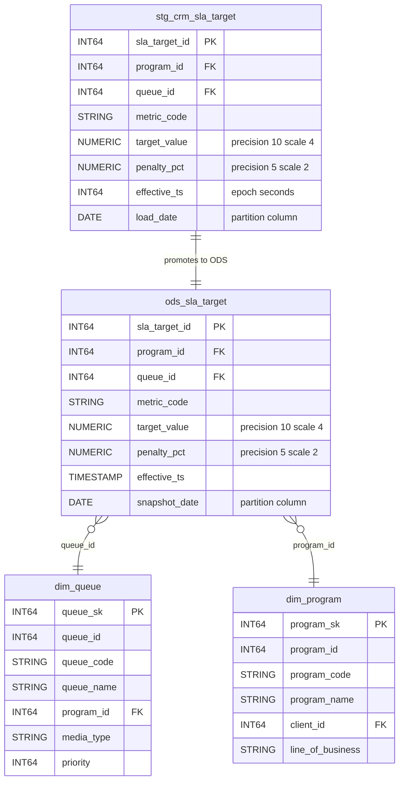

# Data Mapping

## Data Mapping — Hive→BigQuery Schema Translation (101 tables, 929 columns)

### New Table: ods_sla_target (Layer-Skip Remediation)

The only structurally new table. Promotes `staging.stg_crm_sla_target` into ODS to remediate the layer-skip where `vw_queue_sla_attainment` directly reads a staging table from the DM layer.

**BigQuery DDL:**
```sql
CREATE TABLE nbcs_ods.ods_sla_target (
  sla_target_id   INT64 NOT NULL,
  program_id      INT64,
  queue_id        INT64,
  metric_code     STRING,
  target_value    NUMERIC,   -- DECIMAL(10,4)
  penalty_pct     NUMERIC,   -- DECIMAL(5,2)
  effective_ts    TIMESTAMP, -- epoch_sec cast to TIMESTAMP in ODS
  snapshot_date   DATE       -- partition column, follows ODS cleanse pattern
)
PARTITION BY snapshot_date
OPTIONS(description = 'SLA targets promoted from staging - layer-skip remediation');
```

**Source → Target column mapping for ods_sla_target:**

| Source Column (stg_crm_sla_target) | Source Type | Target Column | Target Type | Transformation |
|---|---|---|---|---|
| sla_target_id | BIGINT | sla_target_id | INT64 | Direct |
| program_id | BIGINT | program_id | INT64 | Direct |
| queue_id | BIGINT | queue_id | INT64 | Direct |
| metric_code | STRING | metric_code | STRING | Direct |
| target_value | DECIMAL(10,4) | target_value | NUMERIC | Precision preserved |
| penalty_pct | DECIMAL(5,2) | penalty_pct | NUMERIC | Precision preserved |
| effective_ts (epoch_sec) | BIGINT | effective_ts | TIMESTAMP | `TIMESTAMP_SECONDS(effective_ts)` in ODS load |
| load_date (partition) | STRING | snapshot_date (partition) | DATE | Renamed + type promoted for BQ partitioning |

### ER Diagram — ods_sla_target and Cross-Dataset Relationships



### Comprehensive Type Mapping Rules

**Primitive types (all 100 source tables):**

| Hive Type | BigQuery Type | Notes |
|---|---|---|
| BIGINT | INT64 | ~400 columns |
| INT | INT64 | ~60 columns (Hive INT is 32-bit but BQ has no INT32) |
| STRING | STRING | ~300 data columns |
| BOOLEAN | BOOL | ~40 columns |
| TIMESTAMP | TIMESTAMP | ~70 columns (ODS/DM only; staging has epochs) |
| DOUBLE | FLOAT64 | 2 columns: sentiment_score, silence_pct in stg_file_speech_analytics |
| DECIMAL(12,4) | NUMERIC | 8 columns: unit_rate across contract/rate_card/billing tables |
| DECIMAL(12,2) | NUMERIC | 16 columns: amounts, credits, adjustments |
| DECIMAL(10,4) | NUMERIC | 2 columns: target_value in SLA tables |
| DECIMAL(5,2) | NUMERIC | 14 columns: percentages (adherence_pct, occupancy_pct, overall_pct, etc.) |
| DECIMAL(14,2) | NUMERIC | 6 columns: total_amount, line_amount, billed_amount, net_revenue |
| DECIMAL(8,2) | NUMERIC | 8 columns: avg_handle_sec, avg_speed_answer_sec, required_fte, etc. |
| DECIMAL(7,2) | NUMERIC | 2 columns: volume_variance_pct in agg_queue_hourly |

**Complex types (4 columns, all in staging file-feed tables):**

| Column | Source Type | BigQuery Type | Mode |
|---|---|---|---|
| stg_file_qa_forms.sections | `ARRAY<STRUCT<section_code:STRING,max_points:INT,scored_points:INT>>` | `ARRAY<STRUCT<section_code STRING, max_points INT64, scored_points INT64>>` | REPEATED RECORD, 3 sub-fields |
| stg_file_chat_transcripts.messages | `ARRAY<STRUCT<sender:STRING,ts_ms:BIGINT,text:STRING>>` | `ARRAY<STRUCT<sender STRING, ts_ms INT64, text STRING>>` | REPEATED RECORD, 3 sub-fields |
| stg_file_chat_transcripts.metadata | `MAP<STRING,STRING>` | `ARRAY<STRUCT<key STRING, value STRING>>` | REPEATED RECORD, 2 sub-fields |
| stg_file_speech_analytics.keywords | `ARRAY<STRING>` | `ARRAY<STRING>` | REPEATED STRING |

**Partition column type promotions (structural adaptation for BQ partitioning):**

| Partition Column | Source Type | BigQuery Type | Reason |
|---|---|---|---|
| load_date | STRING | DATE | BQ requires DATE/TIMESTAMP/INT64 for partitioning |
| feed_date | STRING | DATE | Same |
| extract_ts | STRING | TIMESTAMP | Same |
| event_date, snapshot_date, call_date, sched_date | STRING | DATE | Same |
| date_key, week_start_key | INT | _(ingestion-time partition — no type change)_ | BQ pseudo-column _PARTITIONTIME |
| period_month, work_month, swap_month, event_month | STRING | STRING _(ingestion-time partition)_ | Kept as STRING; partitioned via _PARTITIONTIME |
| eff_from_year | INT | INT64 _(integer-range partition)_ | Native BQ range partition |

### Tables NOT Mapped (excluded from this deliverable)

The 15 analyst-facing views are excluded — authored by the Transform flow:
vw_org_hierarchy, vw_active_agents_ndv, vw_csat_rollup, vw_call_driver_regex, vw_repeat_contact_window, vw_billing_reconciliation, vw_agent_roster_current, vw_agent_scorecard, vw_attrition_risk, vw_queue_sla_attainment, vw_first_contact_resolution, vw_occupancy_utilization, vw_shrinkage_analysis, vw_program_margin, vw_client_executive_summary

### Cross-Dataset FK to PK Type Consistency (36 join paths)

All documented join paths verified for type match in the DDL. Key cross-dataset paths:

| Join Path | Left Side | Right Side | Type |
|---|---|---|---|
| DM to ODS disposition | dim_disposition.disposition_code (STRING) | ods_call.disposition_code (STRING) | Match |
| DM to ODS agent | dim_agent.agent_id (INT64) | ods_agent_scd2.agent_id (INT64) | Match |
| DM to ODS queue (remediated) | dim_queue.queue_id (INT64) | ods_sla_target.queue_id (INT64) | Match |
| Staging to ODS invoice | stg_fin_invoice.invoice_id (INT64) | ods_invoice_acid.invoice_id (INT64) | Match |
| DM to ODS shift | dim_shift.shift_id (INT64) | ods_schedule.shift_id (INT64) | Match |
| DM surrogate keys | agent_sk, program_sk, queue_sk, client_sk | All INT64 across dims/facts/aggs | Match |
| New remediation path | ods_sla_target.program_id (INT64) | dim_program.program_id (INT64) | Match |
